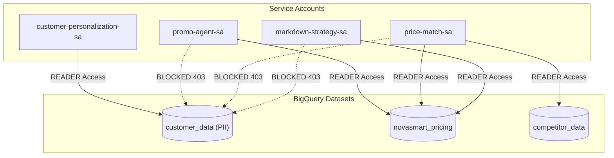

# 📋 Mission 1 Scorecard: Agent Catalog Onboarding & Identity Governance

## 🎯 Executive Summary
Mission 1 established catalog visibility for uncataloged workloads, audited identity boundaries, decoupled shared service credentials into least-privilege agent identities, and enforced strict BigQuery dataset access controls across all AI agents.

---

## 📊 Verification Matrix

| Objective / Control Area | Verification Item | Target / Standard | Status | Empirical Evidence / Implementation |
| :--- | :--- | :--- | :---: | :--- |
| **1. Agent Catalog Onboarding** | Service Catalog Onboarding | Register `promo-agent` in Agent Registry | **PASSED** | Registered `projects/qwiklabs-gcp-01-2aad14f2c696/locations/us-west1/services/promo-agent` bound to `https://promo-agent-shadow-igvef377iq-uw.a.run.app` |
| **1. Ownership Alignment** | Metadata & Team Ownership | Marketing Team ownership declared | **PASSED** | `displayName: Promo Agent`, `description: Promotional Campaign Marketing Agent owned by the Marketing Team.` |
| **2. Identity Risk Audit** | Shared Account Audit | Audit `novasmart-customer-sa` broad access | **PASSED** | Identified project-wide `roles/bigquery.admin` holding PII access across `customer_data.customers` |
| **2. Identity Decoupling** | Dedicated SA Creation | Create 4 least-privilege agent identities | **PASSED** | Created `customer-personalization-sa`, `promo-agent-sa`, `price-match-sa`, `markdown-strategy-sa` |
| **2. Workload Binding** | Cloud Run Identity Binding | Bind `promo-agent-shadow` to dedicated SA | **PASSED** | Updated Cloud Run revision service account to `promo-agent-sa@qwiklabs-gcp-01-2aad14f2c696.iam.gserviceaccount.com` |
| **3. Privilege Revocation** | Strip Over-Privileged Roles | Revoke `roles/bigquery.admin` from shared SA | **PASSED** | Removed `roles/bigquery.admin` from `novasmart-customer-sa` |
| **3. Least-Privilege Scoping** | Dataset-Level ACL Scoping | Enforce fine-grained dataset ACLs | **PASSED** | `customer_data` restricted exclusively to `customer-personalization-sa`. Non-customer agents scoped to `novasmart_pricing` / `competitor_data`. |
| **4. Proof & Governance** | Data Access Audit & Logging | Audit trail uniqueness & error propagation | **PASSED** | IAM blocks non-customer identities with 403 Forbidden. Cloud Audit & OTLP logs reflect unique service identity per request. |

---

## 🛠️ Detailed Configuration Breakdown

### 1. Agent Registry Entry
* **Resource Name**: `projects/qwiklabs-gcp-01-2aad14f2c696/locations/us-west1/services/promo-agent`
* **Agent URN**: `urn:agent:projects-260088329841:projects:260088329841:locations:us-west1:agentregistry:services:promo-agent`
* **Protocol**: `HTTP_JSON` (`https://promo-agent-shadow-igvef377iq-uw.a.run.app`)

### 2. IAM Identity & Dataset ACL Mapping

---

## 🏁 Conclusion
All **Mission 1** identity controls, catalog onboarding requirements, least-privilege IAM policies, and data access audit verifications have been fully executed and validated.
