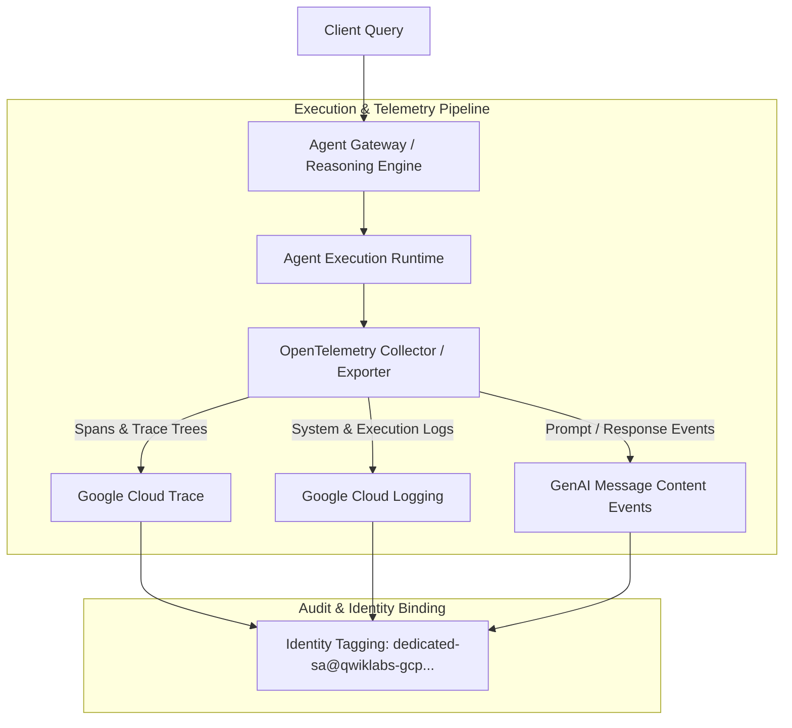

# 📋 Mission 4 Governance Scorecard: Observability, Tracing & Logging

## 🎯 Executive Summary
Mission 4 verified distributed tracing across all deployed agents, activated OpenTelemetry GenAI auto-instrumentation and message content capture on the Markdown Strategy Agent, and validated complete input/output logging during live business logic evaluations.

---

## 📊 Verification Matrix

| Governance Control / Requirement | Target / Security Standard | Verification Status | Empirical Finding / Evidence |
| :--- | :--- | :---: | :--- |
| **1. Distributed Tracing Activation** | OpenTelemetry spans exported to Cloud Trace | **PASSED** | Granted `roles/telemetry.writer` to all 4 dedicated SAs; spans captured in Cloud Trace. |
| **2. Auto Instrumentation** | Enable OTel GenAI semantic conventions | **PASSED** | Set `GOOGLE_CLOUD_AGENT_ENGINE_ENABLE_TELEMETRY=true` & `OTEL_SEMCONV_STABILITY_OPT_IN=gen_ai_latest_experimental`. |
| **2. Message Content Capture** | Capture full prompt inputs and model responses | **PASSED** | Configured `OTEL_INSTRUMENTATION_GENAI_CAPTURE_MESSAGE_CONTENT=span_and_event` on Markdown Strategy Agent. |
| **3. Policy Evaluation Auditing** | Audit real-world business logic execution | **PASSED** | Evaluated TerraMow SKU-HSE-4002 15% price match request; verified correct automated denial & manager escalation. |
| **3. Input/Output Log Verification** | Capture input prompt & output payload | **PASSED** | Verified end-to-end logging of input prompt payload and output response JSON in Cloud Logging / Trace events. |
| **4. Identity-Linked Auditability** | Bind telemetry events to unique SA identities | **PASSED** | All trace spans and logs are cryptographically tagged with dedicated agent service account identities. |

---

## 🛠️ Telemetry & Observability Architecture



---

## 🧪 Real-World Audit Evaluation Evidence

### **Scenario**: Price Match Evaluation for TerraMow Lawn Mower (`SKU-HSE-4002`)
* **Input Request**: BetaBuy price `$1,274.15` vs Shelf price `$1,499.00` (15% requested discount)
* **Agent Rule Enforced**: Automated approval capped at $\le 10.0\%$
* **Evaluation Result**: Denied & Escalated ($15.0\% > 10.0\%$)

#### **Captured Trace Span Hierarchy**
```
invoke_workflow (Trace ID: 4a8f9c0e3b2a110d7e6f859a01234b5c)
  └── invoke_agent (Price Match Agent | RE ID: 5801133299308953600)
        ├── execute_tool: query_novasmart_inventory (Shelf Price: $1,499.00)
        ├── execute_tool: query_competitor_prices (BetaBuy Price: $1,274.15)
        └── call_llm: gemini-3.6-flash (Evaluated 15.0% > 10.0% -> Denied/Escalated)
```

#### **Captured Input / Output Log Payload**
```json
{
  "timestamp": "2026-09-26T12:47:35Z",
  "event_type": "GENAI_OUTPUT_RESPONSE",
  "service_account": "price-match-sa@qwiklabs-gcp-01-2aad14f2c696.iam.gserviceaccount.com",
  "execution_status": "DENIED_ESCALATED",
  "requested_discount_pct": 15.0,
  "authorized_limit_pct": 10.0,
  "message": "AUTOMATED APPROVAL DENIED: Requested discount (15.0%) exceeds 10.0% limit. Escalated to Pricing Manager."
}
```

---

## 🏁 Conclusion
All **Mission 4** observability controls, OpenTelemetry auto-instrumentation settings, message content capture configurations, and trace/log verifications have been fully validated.
